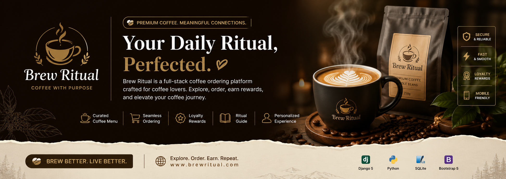
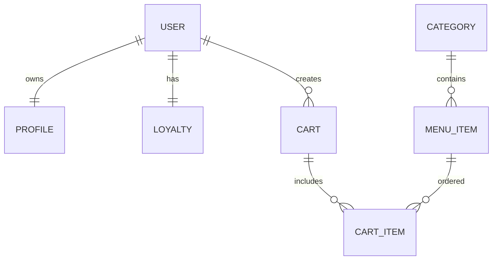
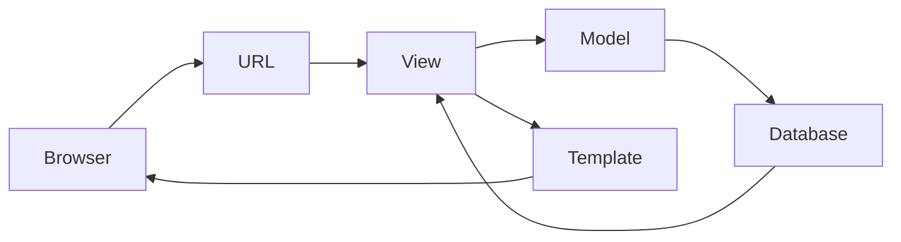

 <p align="center">
  
</p>

<h1 align="center">☕ Brew Ritual</h1>

<p align="center">
A premium full-stack coffee ordering platform built with <strong>Django 5</strong>, focused on elegant UX, loyalty rewards, digital rituals, and modern e-commerce architecture.
</p>

<p align="center">


</p>

---

# ✨ Overview

**Brew Ritual** is more than an online coffee shop.

It combines elegant ordering, customer loyalty, user accounts, personalized experiences, and ritual-inspired interactions into a complete café management platform.

Designed with scalability in mind, the project separates responsibilities into reusable Django applications while maintaining clean architecture.

---

# 🎯 Highlights

- ☕ Beautiful coffee catalog
- 🛒 Shopping cart
- 💳 Checkout flow
- 👤 Authentication system
- ❤️ Favorite coffee profile
- 🎖 Loyalty & reward tiers
- 📚 Ritual guide
- 📱 Responsive design
- ⚡ Optimized Django architecture
- 🔒 Secure authentication
- 🎨 Bootstrap UI
- 🛠 Admin dashboard

---

# 📦 Project Structure

```text
brewritual/
│
├── accounts/
├── loyalty/
├── menu/
├── orders/
├── ritual_guide/
│
├── brewritual/
│
├── static/
├── templates/
├── media/
│
├── manage.py
└── db.sqlite3
````

---

# 🏗 Architecture

```text
                 ┌───────────────────────┐
                 │        Browser        │
                 └──────────┬────────────┘
                            │
                     HTTP Requests
                            │
                 ┌──────────▼───────────┐
                 │      Django URLs     │
                 └──────────┬───────────┘
                            │
         ┌──────────────────┼──────────────────┐
         │                  │                  │
         ▼                  ▼                  ▼
     Accounts            Orders             Menu
         │                  │                  │
         └──────────────┬───┴──────────────┬───┘
                        ▼                  ▼
                 Loyalty System      Ritual Guide
                        │
                        ▼
                    SQLite DB
```

---

# 🧩 Applications

| App             | Description                      |
| --------------- | -------------------------------- |
| 👤 Accounts     | User profiles & authentication   |
| ☕ Menu          | Categories and products          |
| 🛒 Orders       | Cart, checkout and ordering      |
| 🎖 Loyalty      | Reward system & membership tiers |
| 📖 Ritual Guide | Educational coffee content       |

---

# 🚀 Features

## ☕

Coffee Menu

* Categories
* Rich product pages
* Images
* Product descriptions

---

## 🛒

Shopping Experience

* Add to cart
* Quantity updates
* Remove items
* Session cart
* User cart

---

## 👤

Accounts

* Register
* Login
* Profile
* Favorite drink
* Personal bio

---

## 🎖

Loyalty

* Bronze
* Silver
* Gold
* Platinum

Reward progression included.

---

## 📖

Ritual Guide

Educational section introducing coffee rituals and brewing culture.

---

# 🗄 Database



---

# ⚙ Technology Stack

| Layer    | Technology   |
| -------- | ------------ |
| Backend  | Django 5     |
| Language | Python       |
| Frontend | HTML5        |
| Styling  | Bootstrap    |
| Database | SQLite       |
| Images   | Pillow       |
| Forms    | Crispy Forms |

---

# 📸 Screenshots

```
assets/
    home.png
    menu.png
    checkout.png
    dashboard.png
```

Replace with your own screenshots.

---

# 🚀 Installation

```bash
git clone https://github.com/yourname/brewritual.git

cd brewritual

pip install django pillow crispy-bootstrap5 django-crispy-forms

python manage.py migrate

python manage.py seed_menu

python manage.py collectstatic --noinput

python manage.py runserver
```

---

# 🌳 Request Flow



---

# 📂 Core Modules

```
Authentication
        │
        ▼

 User Profile
        │
        ▼

 Loyalty
        │
        ▼

 Coffee Menu
        │
        ▼

 Cart
        │
        ▼

 Checkout
```

---

# 🎨 UI Philosophy

* Warm colors
* Elegant typography
* Coffee-inspired visuals
* Minimal navigation
* Mobile first
* Clean hierarchy

---

# 🔒 Security

✅ Django Authentication

✅ CSRF Protection

✅ ORM Queries

✅ Secure Forms

✅ Session Management

---

# 📈 Future Improvements

* Stripe Payments
* Email Notifications
* REST API
* Dark Mode
* Product Reviews
* Wishlist
* Coupons
* Inventory
* Analytics Dashboard
* Multi-language

---

# 🤝 Contributing

```bash
Fork

↓

Create Branch

↓

Commit

↓

Push

↓

Open Pull Request
```

---

# ⭐ Support

If you like this project,

⭐ Star the repository

🍴 Fork it

🛠 Contribute

---

# 📄 License

Released under the MIT License.

---

<p align="center">

Made with ❤️ and ☕

<b>Brew Ritual</b>

</p>
